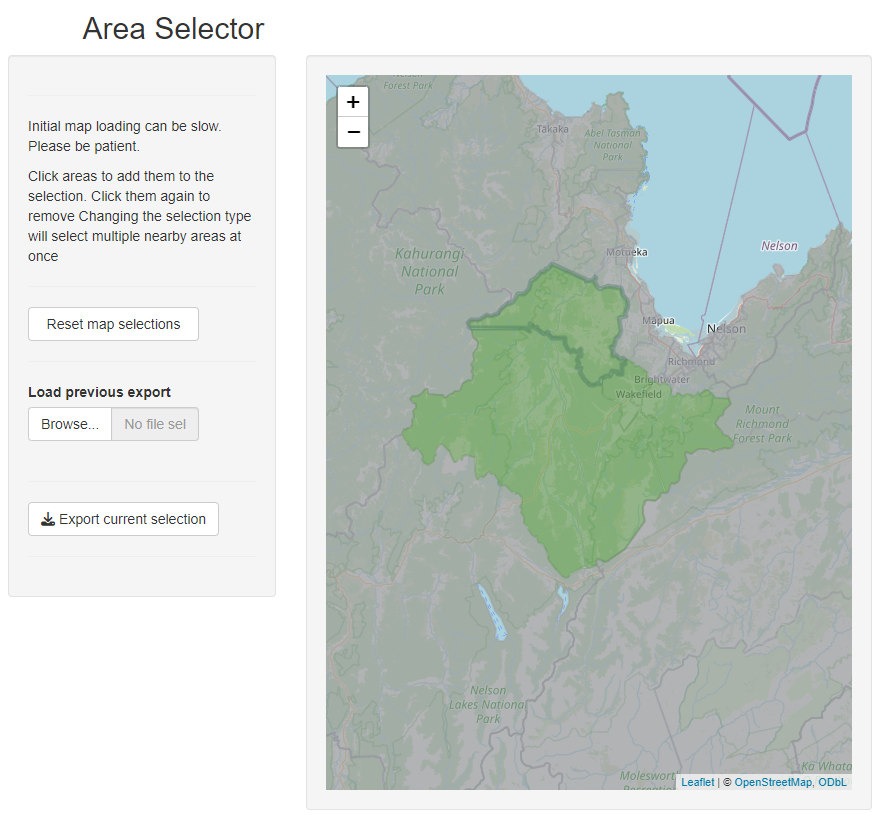

# Area selection app
Shiny app for selecting SA2 areas

## Explanation
This is a simple R shiny app that displays a map of New Zealand overlaid by the SA2 boundaries. Users can click on boundaries to create a custom region as a combination of SA2 boundaries. Once the desired custom region has been created, this can be exported.

The exported CSV file will have SA2 codes consistent with other Stats NZ data sources, like the IDI. This means that selected areas can be used as an input to analyse custom regions.

## Files
There are three key R files:
1. `SA2_map_data_prep.R` does the data preparation, converting the publicly available shape file into a format suitable for loading into the app.
2. `SA2_higher_geographies_2025.Rds` is an R data file containing the prepared data for ease of loading into the app.
3. `app_area_selection.R` is the file to execute to run the app.

## The choice of SA2
Stats NZ provides a range of geographic boundaries of varying levels of detail. For example: Meshblock, SA1, SA2, SA3, Local Board, Territorial Authority, Electoral Boundaries, and Region. We have chosen SA2 for this app as an estimate for the most useful level of detail. More detailed maps could be used, for example Meshblock, but then selecting the same custom region would require many more selections. Alternatively, a less detailed map could be used but this would limit the precision with which the customer region can be defined.

## Getting Help
Enquiries can be sent to info@sia.govt.nz
